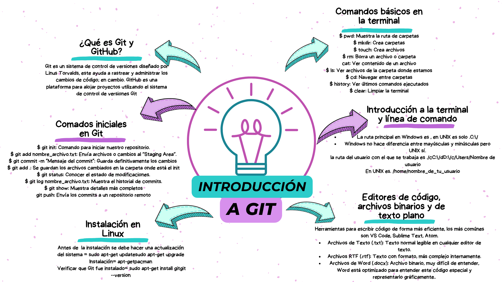
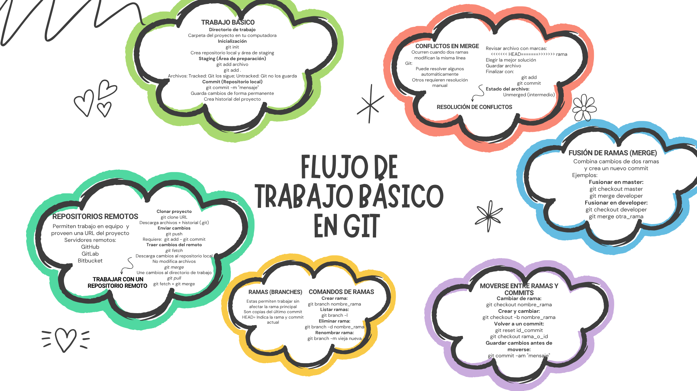
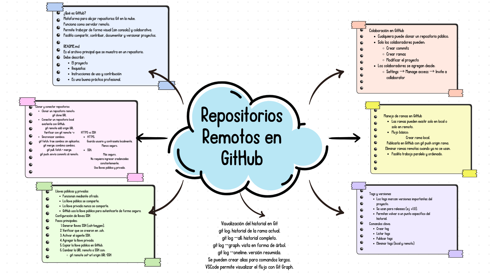
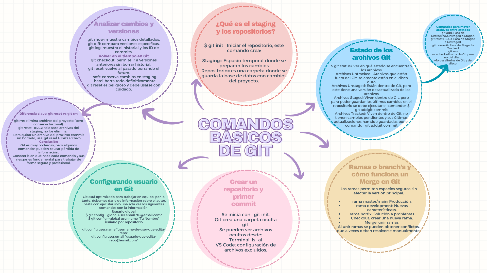

📘 Introducción a Git
📌 ¿Qué es Git y GitHub?

Git es un sistema de control de versiones diseñado por Linus Torvalds.
Permite rastrear y administrar los cambios en el código fuente de un proyecto.

GitHub es una plataforma que permite alojar proyectos utilizando el sistema de control de versiones Git, facilitando el trabajo colaborativo.

🖥️ Introducción a la terminal y línea de comando

En Windows, la ruta principal es:

C:\
Windows no diferencia entre mayúsculas y minúsculas, pero en UNIX/Linux sí existe esta diferencia.

Ruta del usuario en Windows:

C:\Users\Nombre_de_usuario

Ruta del usuario en UNIX/Linux:

/home/nombre_de_tu_usuario
💻 Comandos básicos en la terminal
Comando	Descripción
pwd	Muestra la ruta actual
mkdir	Crea carpetas
touch	Crea archivos
rm	Borra archivos o carpetas
cat	Muestra el contenido de un archivo
ls	Lista archivos de la carpeta actual
cd	Navega entre carpetas
history	Muestra los últimos comandos ejecutados
clear	Limpia la terminal
🚀 Comandos iniciales en Git
Comando	Descripción
git init	Inicializa un repositorio
git add nombre_archivo.txt	Agrega un archivo al área de preparación (Staging Area)
git add .	Agrega todos los archivos modificados
git commit -m "Mensaje"	Guarda los cambios de forma permanente
git status	Muestra el estado del repositorio
git log nombre_archivo.txt	Muestra el historial de commits
git show	Muestra detalles de un commit
git push	Envía los commits al repositorio remoto
🐧 Instalación de Git en Linux

Antes de instalar Git, actualizar el sistema:

sudo apt-get update
sudo apt-get upgrade

Instalar Git:

sudo apt-get install git

Verificar instalación:

git --version
📝 Editores de código y tipos de archivos
🔧 Editores de código

Algunos editores comunes:

VS Code
Sublime Text
Atom
📄 Tipos de archivos
.txt → Texto plano, legible en cualquier editor.
.rtf → Texto con formato.
.docx → Archivo binario, más complejo internamente (usado por Word).

📚 Comandos Básicos de Git
📦 ¿Qué es el Staging y los repositorios?
🔹 git init

Inicia el repositorio y crea:

Staging Area → Espacio temporal donde se preparan los cambios antes de confirmarlos.
Repositorio → Carpeta donde se guarda la base de datos con los cambios del proyecto.
📊 Estado de los archivos en Git
🔹 git status

Permite ver en qué estado se encuentran los archivos.

Estados posibles:
Untracked
Archivos que están fuera de Git, solo existen en el disco.
Unstaged
Archivos dentro de Git pero con cambios no preparados para commit.
Staged
Archivos listos para guardarse en el repositorio (después de git add).
Tracked
Archivos que Git ya está siguiendo y cuyos cambios han sido guardados con git commit.
🔄 Comandos para mover archivos entre estados
git add → Pasa de Untracked/Unstaged a Staged
git reset HEAD archivo → Pasa de Staged a Unstaged
git commit → Pasa de Staged a Tracked
git rm → Elimina archivo de Git
git rm --cached archivo → Elimina archivo de Git pero lo mantiene en el disco
git rm --force → Elimina definitivamente de Git y del disco
🌿 Ramas (Branch) y Merge en Git

Las ramas permiten trabajar sin afectar la versión principal.

Tipos comunes de ramas:
master/main → Producción
development → Nuevas características
hotfix → Solución de problemas urgentes
Comandos importantes:
git checkout -b nombre-rama → Crear nueva rama
git merge nombre-rama → Unir ramas

⚠ Al hacer merge pueden surgir conflictos, que deben resolverse manualmente.

🆕 Crear un repositorio y primer commit

Iniciar repositorio:

git init

Git crea una carpeta oculta llamada:

.git

Ver archivos ocultos:

ls -al

En VS Code también se pueden ver configurando los archivos ocultos.

⚙ Configurar usuario en Git

Git necesita identificar al autor de los commits.

🔹 Usuario global (para todos los repositorios)
git config --global user.name "Tu Nombre"
git config --global user.email "tu@email.com"
🔹 Usuario por repositorio
git config user.name "Nombre del repo"
git config user.email "email-del-repo@email.com"
🔍 Analizar cambios y versiones
git show → Muestra cambios detallados
git diff → Compara versiones específicas
git log → Muestra historial e ID de commits
⏳ Volver en el tiempo en Git
git checkout → Permite ir a versiones anteriores sin borrar historial
git reset → Vuelve al pasado borrando commits
Tipos de reset:
--soft → Conserva cambios en staging
--hard → Borra todo definitivamente ⚠

git reset es un comando poderoso y debe usarse con cuidado.

⚠ Diferencia clave: git reset vs git rm
git rm → Elimina archivos del proyecto
git reset HEAD archivo → Saca un archivo del staging sin borrarlo
🧠 Conclusión

Git es una herramienta muy poderosa, pero algunos comandos pueden causar pérdida de información.
Es fundamental entender bien qué hace cada comando y sus riesgos para trabajar de forma segura y profesional.

🔄 Flujo de Trabajo Básico en Git
🟢 Trabajo básico
📁 Directorio de trabajo

Es la carpeta del proyecto en tu computadora.

🚀 Inicialización
git init
Crea el repositorio local.
Crea el área de Staging (área de preparación).
➕ Agregar archivos al staging
git add archivo
git add .
📝 Commit (Repositorio local)
git commit -m "mensaje"
Guarda los cambios de forma permanente.
Crea el historial del proyecto.
📌 Estados de archivos
Tracked → Git los guarda y controla.
Untracked → Git no los guarda aún.
🌐 Repositorios remotos

Permiten trabajar en equipo y se conectan mediante una URL.

🔹 Servidores remotos populares:
GitHub
GitLab
Bitbucket
📥 Clonar un proyecto
git clone URL
Descarga archivos + historial (.git).
📤 Enviar cambios al remoto
git add .
git commit -m "mensaje"
git push
📥 Traer cambios del remoto
Solo descargar cambios (no modifica archivos automáticamente)
git fetch
Descargar y fusionar automáticamente
git pull

git pull = git fetch + git merge

🌿 Ramas (Branches)

Permiten trabajar sin afectar la rama principal.

Son copias del último commit (HEAD).
Indican la rama actual.
🛠 Comandos de ramas
Crear rama
git branch nombre_rama
Listar ramas
git branch -l
Eliminar rama
git branch -d nombre_rama
Renombrar rama
git branch -m vieja nueva
🔀 Fusión de ramas (Merge)

Combina cambios de dos ramas y crea un nuevo commit.

Ejemplo:

Fusionar en master:

git checkout master
git merge developer

Fusionar en developer:

git checkout developer
git merge otra_rama
⚠ Conflictos en Merge

Ocurren cuando dos ramas modifican la misma línea de un archivo.

Git puede:

Resolver algunos automáticamente.
Requerir resolución manual.
Cómo resolver conflictos:

Revisar el archivo con marcas:

<<<<<<< HEAD
>>>>>>> rama
Elegir la mejor solución.
Guardar archivo.

Finalizar:

git add archivo
git commit

Estado del archivo:

Unmerged (intermedio)
🔁 Moverse entre ramas y commits
Cambiar de rama
git checkout nombre_rama
Crear y cambiar de rama
git checkout -b nombre_rama
Volver a un commit específico
git checkout id_commit
Volver atrás (reset)
git reset id_commit

⚠ Antes de moverte entre ramas, guarda cambios:

git commit -am "mensaje"

🌐 Repositorios Remotos en GitHub
🔷 ¿Qué es GitHub?

GitHub es una plataforma para alojar repositorios Git en la nube.

Funciona como servidor remoto.
Permite trabajar de forma visual (sin consola) y colaborativa.
Facilita compartir, contribuir, documentar y versionar proyectos.
📄 README.md

Es el archivo principal que se muestra en un repositorio.

Debe describir:

📌 El proyecto
⚙ Requisitos
📖 Instrucciones de uso
🤝 Cómo contribuir

Es una buena práctica profesional incluirlo.

🔗 Clonar y conectar repositorios
📥 Clonar repositorio remoto
git clone URL
🔗 Conectar repositorio local a GitHub
git remote add origin URL
git remote -v
🔄 Sincronizar cambios
📥 Traer cambios
git fetch

Descarga cambios sin aplicarlos.

git pull

Descarga y fusiona cambios automáticamente.

📤 Enviar cambios
git push
🔐 HTTPS vs SSH
🔸 HTTPS
Guarda usuario y contraseña localmente.
Menos seguro.
Requiere credenciales constantemente.
🔸 SSH
Más seguro.
No requiere ingresar credenciales cada vez.
Usa llaves pública y privada.
🔑 Llaves públicas y privadas (SSH)
Funcionan mediante cifrado.
🔓 La llave pública se comparte.
🔒 La llave privada nunca se comparte.
GitHub usa la llave pública para autenticarte.
⚙ Configuración de llaves SSH
1️⃣ Generar llaves SSH
ssh-keygen
2️⃣ Verificar conexión
ssh -T git@github.com
3️⃣ Activar agente SSH
eval "$(ssh-agent -s)"
4️⃣ Agregar llave privada
ssh-add ~/.ssh/id_rsa
5️⃣ Copiar llave pública en GitHub

Ir a:

Settings → SSH and GPG keys → New SSH key
6️⃣ Cambiar URL remota a SSH
git remote set-url origin URL_SSH
👥 Colaboración en GitHub
Cualquiera puede clonar un repositorio público.
Solo los colaboradores pueden:
Crear commits
Crear ramas
Modificar el proyecto

Agregar colaboradores desde:

Settings → Manage access → Invite a collaborator
🌿 Manejo de ramas en GitHub
Las ramas pueden existir:
Solo en local
Solo en remoto
Flujo básico:
Crear rama local
Publicarla:
git push origin nombre_rama
Eliminar ramas remotas cuando ya no se usan

Beneficio:
✔ Facilita trabajo paralelo y ordenado

🏷 Tags y versiones

Los tags marcan versiones importantes del proyecto.

Ejemplo:

v1.0

Permiten volver a un punto específico del historial.

Comandos clave:

Crear tag:

git tag nombre_tag

Listar tags:

git tag

Publicar tag:

git push origin nombre_tag

Eliminar tag:

git tag -d nombre_tag
git push origin --delete nombre_tag
📊 Visualización del historial en Git
git log

Historial de la rama actual.

git log --all

Historial completo.

git log --graph

Vista en forma de árbol.

git log --oneline

Versión resumida.

💡 Se pueden crear alias para comandos largos.
VS Code permite visualizar el flujo con Git Graph.
